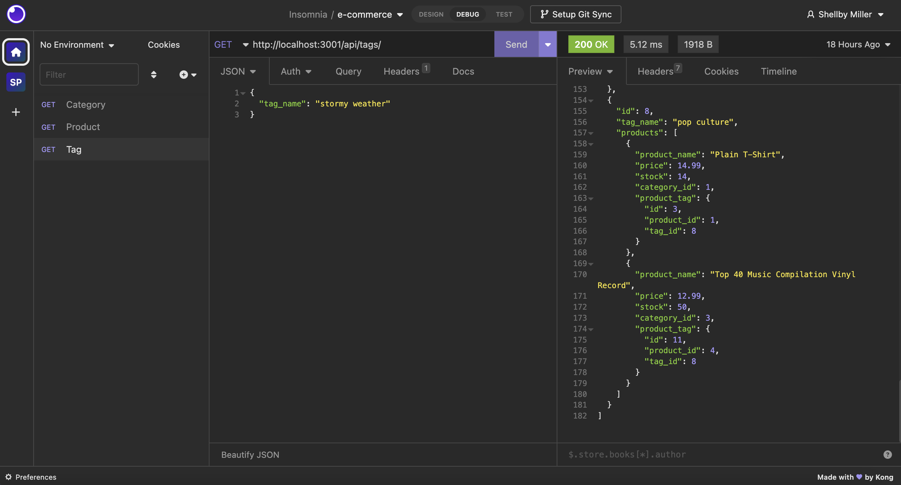

# upgraded-spork

## Description

upgraded-spork is the back end for an e-commerce application that uses `Sequelize`to interact with a `MySQL` database.

## Table of Contents
* [Installation](#installation)
* [Usage](#usage)
* [Application Demo ](#application-demo)

## Installation

To create your own e-commerce app, `git clone` the repo so you have the project on your local development environemnt.

`MySQL2` and `Sequelize` packages will need to be installed to connect this Express.js API to a MySQL database.

`dotenv` package should be installed and environment variables should be used to store sensitive data (MySQL username, password, database name) in a `.env` file.

While in the root directory of the project, run `mysql -u root -p` in the terminal, then 'source db/schema.sql` to create the tables.

`Exit` the mysql terminal.

`npm run seed` to seed the data into the tables.

`npm start` to start th server.

## Usage
Use `Insomnia` to test GET, POST, PUT, and DELETE routes for categories, products, and tags.

## Application Demo

The following image captures the back end of the e-commerce application in `Insomnia`:

Use the following link to find the demo video of the back end of upgraded-spork:
https://drive.google.com/file/d/1xABx96LWQqgpjI1oFOn88yA_7Md_jdfx/view

